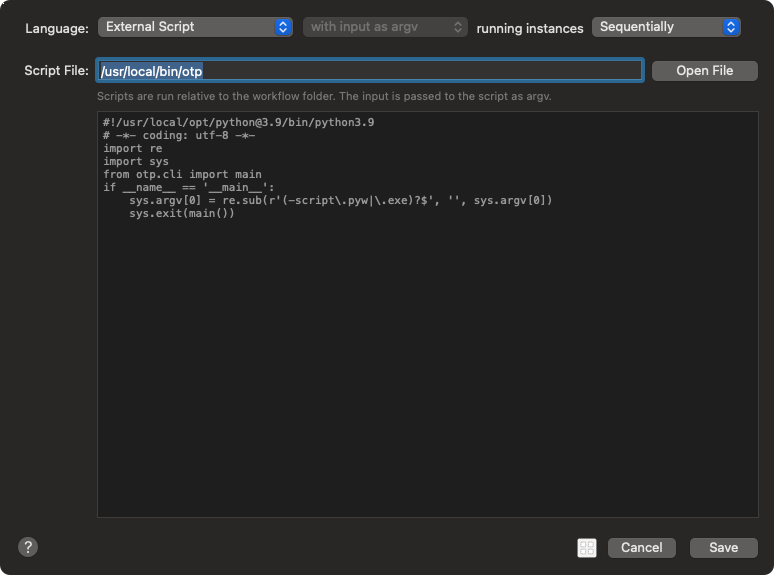

# otp
 Script to generate and type otp's for various services.

## Install instructions

```bash
python3.9 -m pip install --upgrade https://github.com/alphabet5/otp/releases/download/0.0.1/otp-0.0.1-py2.py3-none-any.whl
```

## Build and Installinstructions

```bash
git clone https://github.com/alphabet5/otp.git
cd otp
python3.9 setup.py bdist_wheel --universal
python3.9 -m pip install dist/*
```

## Usage

Typically I use this with Alfred to enter otp codes for various applications. 

Keyword "otp" space "Argument" where the argument is the name of the keychain username where the otp url is stored.





If your keychain doesn't contain the site otp url, you will be asked to save it with a prompt.


OTP Urls typically look like this, and can often distributed as a QR code.

```text
otpauth://totp/Example%3Aemail.address%40example.com?secret=asdfg1hj2kl3la&issuer=Microsoft
```

OTP generation can be done manually with
```bash
/usr/local/bin/otp site_or_application
```

